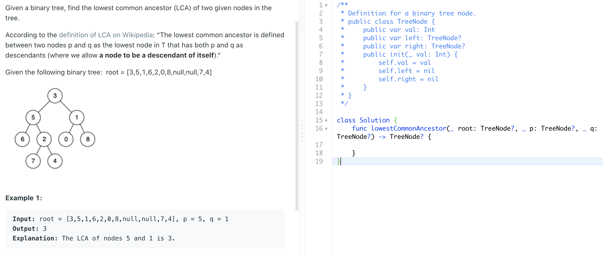
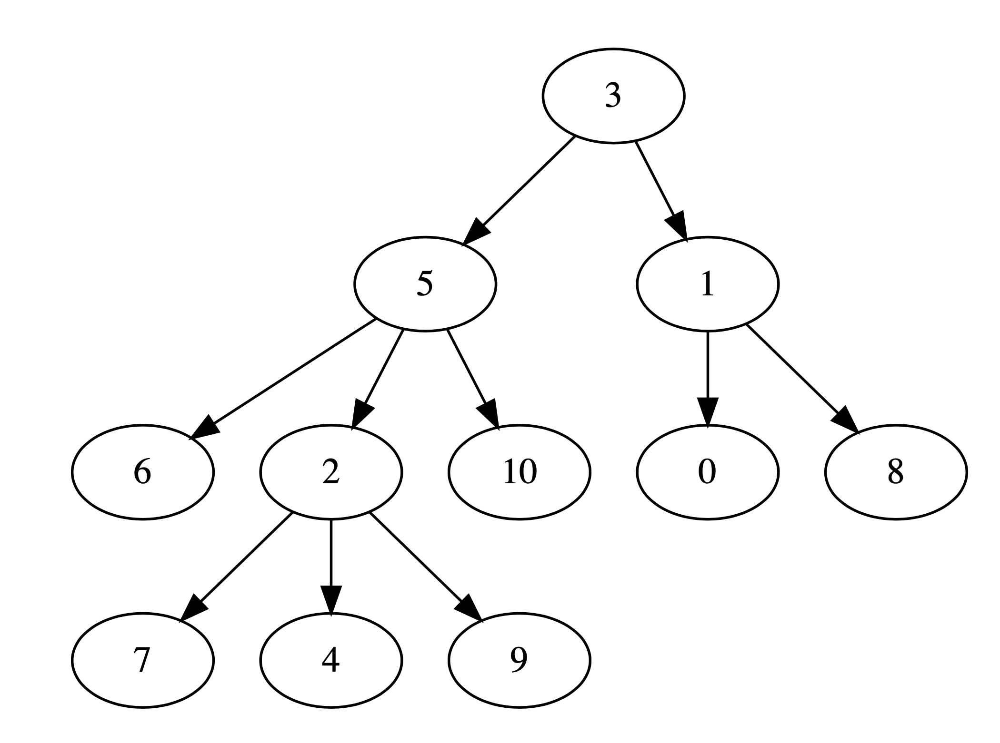

# tree_solution

오늘 면접에서 주신 문제는 아래와 같았습니다.



```swift
public class TreeNode {
    public var val: Int
    public var left: TreeNode?
    public var right: TreeNode?
    public init(_ val: Int) {
        self.val = val
        self.left = nil
        self.right = nil
    }
}
```

여기서 조금 심화해보면, 위와 같이 tree의 개수가 `left`와 `right`, 2개로만 이루어져 있는 것이 아닌

```swift
struct TreeNode {
    var val: Int
    var trees: [TreeNode]
}
```

위와 같이 여러개의 `TreeNode`를 받을 수 있도록 문제를 바꿔봤습니다. 그림으로 표현하자면 1개의 아래 그림과 같이 3개 이상의 나무를 받을 수 있게 되지요.



또한 `TreeNode`를 Python의 `graphviz` 라이브러리를 사용해서 시각화하는 코드도 짜봤습니다. 예를 들어 아래 코드를 위 그림과 같이 그림으로 표현해주는 것입니다.

```swift
let node = TreeNode(val: 3, trees: [
    TreeNode(val: 5, trees: [
        TreeNode(val: 6, trees: []),
        TreeNode(val: 2, trees: [
            TreeNode(val: 7, trees: []),
            TreeNode(val: 4, trees: []),
            TreeNode(val: 9, trees: [])
        ]),
        TreeNode(val: 10, trees: [])
    ]),

    TreeNode(val: 1, trees: [
        TreeNode(val: 0, trees: []),
        TreeNode(val: 8, trees: [])
    ])
])
```

## 실행

`$ swift run`

[main.swift](Sources/tree_solution/main.swift)를 보시면 p는 6, q는 9일 때 parent tree를 찾도록 되어 있습니다. 답은 5가 나옵니다.

## 그림으로 표현

실행하면 [Visualize](Visualize) 폴더에 [node.dot](Visualize/node.dot)이 생깁니다. 그러면 [visualize_dot.py](Visualize/visualize_dot.py)를 실행하시면 됩니다.

`$ cd Visualize`

`$ python3.6 visualize_dot.py`

그러면 [node.dot.pdf](Visualize/node.dot.pdf)이 생깁니다.
